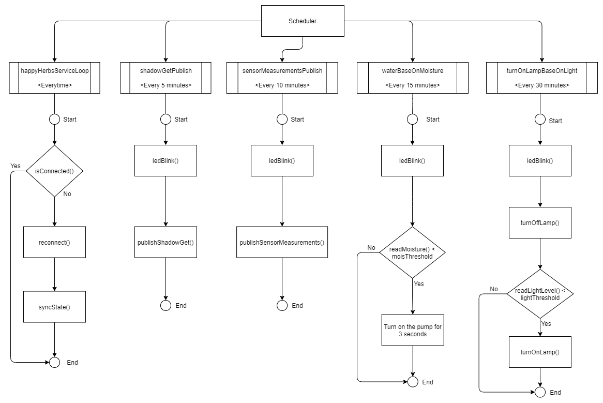
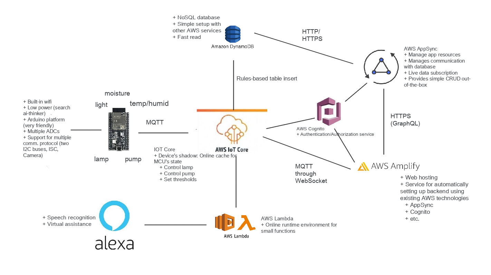
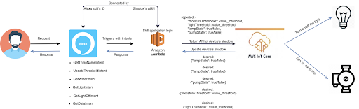

# Automatic Watering and Lighting System for Potted Plants

## Hardware devices

Controller: AI-Thinker ESP12K (NodeMCU ESP32S2). Programmed with Arduino.
+ Pros:
    + Built-in WiFi
    + Low power consumption
    + Can be developed with using the Arduino platform
        + Many libraries
        + Lots of support from the community
        + Friendly for beginner
    + Multiple ADCs (upto 20 pins).
    + Support for multiple communication protocols (such as two I2C buses, ISC,camera,etc).
        + 2x I2C buses
        + 1x ISC bus
        + 1x Bus for external camera
        + 1x USB to UART
        + etc.
+ Cons:
    + It's a new board so there less not much support => The tool chain for developing with the board using Arduino still has many problems

Sensors:
+ BH1750 light meter sensor
+ Resistive moisture sensor
+ DHT11 temperature and humidity sensor

External devices:
+ Lamp
+ Water pump

## Connections

To project utilizes the serverless architecture provided by AWS and uses Javascript for development.
+ Pros:
    + Low-code maintenance
    + Communication between different services within the same eco-system can be established and configures easily
    + Documentation is extensive and usage can be found (just hard)
+ Const:
    + Going through the documentations for every service is time consuming
        + The documentation lacks examples for common use cases
        + It's very long
    + Connecting a self-developed external service to the eco-system requires lots of work
    + We can only stick to what the Free Tier provides

Communication between the MCU and AWS, and communication between the MCU and the user use AWS IoT Core. Two main functionalities of the service are used:
+ MQTT broker: To communicate with the outside world, the MCU will send messages, receives commands and state updates using the MQTT protocol. A broker with public endpoint is automatically established for use. A message are formatted in JSON.
    + PUBLISH: "sensorsMeasurements"
    + PUBLISH: "$aws/thing/thing_name/shadow/get"
    + PUBLISH: "$aws/thing/thing_name/shadow/update"
    + SUBSCRIBE: "$aws/thing/thing_name/shadow/update/delta"
    + SUBSCRIBE: "$aws/thing/thing_name/shadow/update/accepted"
    + SUBSCRIBE: "$aws/thing/thing_name/shadow/update/rejected"
    + SUBSCRIBE: "$aws/thing/thing_name/shadow/get/accepted"
    + SUBSCRIBE: "$aws/thing/thing_name/shadow/get/rejected"
+ Thing's shadow: A service that stores the virtual state of the MCU which keeps track of two kinds of state "desired" and "reported" in JSON format. The virtual state can then be modified concurrently by both the user and the MCU.
    + The "desired state" indicates the state which the user wishes the MCU to be in.
    + The "reported state" indicates the state which is currently reflected by the MCU
    + The shadow can be UPDATE, DELETE, or RETRIEVE
    + Every time there is a different between "desired" and "reported", a message is sent to the MCU so that it can update it state to be equal to the "desired" state.
    + Communication simulates typical HTTP flow using MQTT

To store the sensors data that is sent back by the MCU, AWS DynamoDB is used. This is a NoSQL database and each column and their values are determined by the MCU
+ Pros:
    + High concurrently read/write rate
    + Do not have to spent time designing the database
    + The database "schema" is evolved overtime to reflect the current workflow
+ Cons:
    + Database schema can become messy if not planned carefully
    + Client code must handle nullable fields since there is no explicit schema

The user interface uses Vue as the frontend framework and is then hosted using AWS Amplify this service provides tools for setting up common features that are required by a website
+ To control the MCU, the website communicate with AWS IoT Core through MQTT over HTTP. This functionality is provided directly by the Amplify SDK
+ To view the sensors data that are returned by the MCU, an API service with AWS AppSync is set up through the AWS Amplify tools sets. The API service is connected with AWS DynamoDB where the table for the sensors' measurements is stored.
    + AWS AppSync is a service for setting up API endpoints using GraphQL. This supports:
        + Data queries/updates similar the RESTful architecture.
        + Real-time data sync
+ Communication between the user and AWS is secured using AWS Cognito and AWS IAM's permissions so that only authenticated user can access the website.
    + AWS Cognito is a service that allow adding user's authentication to existing services on AWS. This supports:
        + User can register their account and login to the service.
        + Permission can be specified for specific user with specific scope.
        + Authentication with third party services.
    + AWS IAM allows setting up access key for programmatic service accesses

Amazon Alexa and AWS Lambda are use to provide addition methods for controlling the MCU.
+ Functions that modify that device's shadow is implemented on Amplify, each time an Alexa's command is triggered, the corresponding AWS Lambda's function is called.
    + Amazon Alexa is a speech recognition system where commands can be registered and triggered when a specific sphrase/sentence is provided.
    + AWS Lambda is a lightweight online runtime for programming languages that can use the AWS SDK. Each feature can be implemented as a independent function and triggered the need methods from AWS SDK.

## Data processing

+ AWS SageMaker provides Python notebook instances for training AI/ML models and data can be loaded directly from other AWS database services
+ AWS Athena provides SQL-based analysis engine that provides real time events trigger and analytics

=> These are not free + No real data to train on
